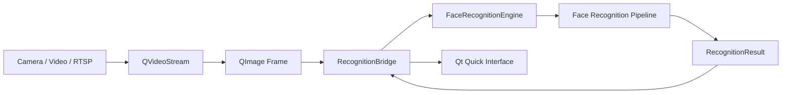

<div align="center">

# FaceRecognitionLibUsage

**A minimal Qt Quick application demonstrating how to integrate and use FaceRecognitionLib in an external C++ project.**

[](#requirements)
[](#requirements)
[](#requirements)
[](#build)
[](#requirements)
[](#features)

</div>

</div>
<div align="center">
<video src="https://github.com/user-attachments/assets/85125da1-db96-4039-93c2-ceb3f975160b"></video>
</div>
▶️ [Demo Here](https://github.com/DarkShrill/FaceRecognition/blob/master/docs/test.mp4)

---

## Overview

**FaceRecognitionLibUsage** is a small example application showing how to integrate the reusable DLL produced by [Face Recognition](https://github.com/DarkShrill/FaceRecognition) into an independent **Qt, QML and C++** project.

The application receives frames from `QVideoStream`, sends them to `FaceRecognitionLib` and displays the recognition results through a custom QML interface.

It is intended as a practical reference for developers who want to reuse the face-recognition backend without including the complete original GUI.

<!-- Add a screenshot or animated GIF here when available.

<p align="center">
  
</p>

-->

## Features

* Real-time face detection and recognition.
* Native integration with `FaceRecognitionLib`.
* Video input through `QVideoStream`.
* Support for webcams, video files and compatible network streams.
* CPU and CUDA inference modes.
* Recognized names and confidence values.
* Face bounding boxes rendered directly in QML.
* Runtime-selectable landmark visualization:

  * disabled;
  * 5 points;
  * 106 points;
  * all available landmarks;
  * 68 three-dimensional points.
* Recognition results exposed from C++ to QML through `RecognitionBridge`.
* Automatic copying of DLLs, models and runtime files after compilation.

## Requirements

The project currently targets **Windows x64** and must be compiled using the **MSVC toolchain**.

| Dependency         | Recommended version               |
| ------------------ | --------------------------------- |
| Visual Studio      | Visual Studio 2022 / MSVC v143    |
| Qt                 | Qt 6.9 or later, MSVC 2022 64-bit |
| C++                | C++17                             |
| FaceRecognitionLib | Built in DLL mode                 |
| QVideoStream       | Compatible Windows build          |
| OpenCV             | 4.13.0                            |
| ONNX Runtime       | 1.20.1                            |
| CUDA               | 12.x, optional                    |
| cuDNN              | 9.x, optional                     |
| FFmpeg             | Required by QVideoStream          |

> [!IMPORTANT]
> Use a **Qt MSVC 2022 64-bit kit**. MinGW libraries are not compatible with the precompiled MSVC binaries.

## Download

The GitHub repository does not contain all the files required to compile and run the application.

In addition to cloning the repository, download the required package containing the external headers, libraries, DLLs and ONNX models:

* [Download external libraries](https://github.com/DarkShrill/FaceRecognitionLibUsage/releases/download/v1.0.0.0/external_lib_to_include.zip)
* [Download recognition models](https://github.com/DarkShrill/FaceRecognitionLibUsage/releases/download/v1.0.0.0/models.zip)

After downloading the archive, extract its contents directly into the root directory of the repository.

The resulting structure should look similar to this:

```text
FaceRecognitionLibUsage/
├── FaceRecognitionLibUsage.pro
├── main.cpp
├── Main.qml
├── RecognitionBridge.cpp
├── RecognitionBridge.h
├── qml.qrc
│
├── external_includes/
│   ├── facerecognition/
│   ├── qvideostream/
│   ├── opencv/
│   ├── onnxruntime/
│   └── ffmpeg/
│
├── external_libs/
│   ├── facerecognition/
│   │   ├── bin/
│   │   └── lib/
│   ├── qvideostream/
│   │   ├── bin/
│   │   └── lib/
│   ├── opencv/
│   ├── onnxruntime/
│   └── ffmpeg/
│
├── models/
│   ├── det_500m.onnx
│   ├── 2d106det.onnx
│   ├── 1k3d68.onnx
│   └── w600k_mbf.onnx
│
└── face_embeddings/
```

> [!WARNING]
> Do not move or rename the extracted directories unless you also update the paths defined in `FaceRecognitionLibUsage.pro`.

## Quick Start

### 1. Clone the repository

```powershell
git clone https://github.com/DarkShrill/FaceRecognitionLibUsage.git
cd FaceRecognitionLibUsage
```

### 2. Download the required files

Download the external runtime and development package from:

```text
LINK
```

Extract the archive into the repository root.

Make sure that the following directories are present before opening the project:

```text
external_includes/
external_libs/
models/
face_embeddings/
```

### 3. Open the project

Open the following file with Qt Creator:

```text
FaceRecognitionLibUsage.pro
```

Select a **Qt 6.9+ MSVC 2022 64-bit** kit.

### 4. Build

1. Run **qmake**.
2. Select the Release configuration.
3. Build the project.
4. Run `FaceRecognitionLibUsage.exe`.

The qmake post-build commands automatically copy the required DLLs, executables, models and face embeddings into the application output directory.

## Usage

The application automatically initializes the recognition engine when the QML interface is loaded.

Enter a source in the top input field and press **Play**.

### Webcam

```text
video=Integrated Camera
```

Replace `Integrated Camera` with the name of the camera installed on your system.

### Video file

```text
C:\Users\User\Videos\example.mp4
```

### Network stream

```text
rtsp://192.168.1.100:554
```

Use the **CUDA** checkbox to request GPU inference.

When CUDA is disabled, the recognition engine uses CPU inference.

Use the landmark selector to choose which facial points should be displayed:

| Mode     | Description                            |
| -------- | -------------------------------------- |
| None     | Do not display landmarks               |
| 5 points | Display the five main alignment points |
| 106      | Display 106 two-dimensional landmarks  |
| All      | Display all available landmark types   |
| 3D68     | Display 68 three-dimensional landmarks |

## How It Works



`QVideoStream` provides video frames to the QML interface.

Each frame is forwarded to `RecognitionBridge`, converted from `QImage` to `cv::Mat` and submitted asynchronously to `FaceRecognitionEngine`.

Recognition results are converted into QML-compatible objects containing:

* face coordinates;
* recognized identity;
* confidence percentage;
* five-point landmarks;
* 106-point landmarks;
* 68-point three-dimensional landmarks.

The QML interface uses these results to draw bounding boxes, labels and facial landmarks over the video.

## Using FaceRecognitionLib

The reusable face-recognition API is provided by the main repository:

### [Qt Face Recognition](https://github.com/DarkShrill/FaceRecognition)

The main integration point is `FaceRecognitionEngine`.

A simplified usage example is:

```cpp
auto engine = std::make_unique<FaceRecognitionEngine>(
    InferenceDevice::CPU
);

connect(
    engine.get(),
    &FaceRecognitionEngine::resultReady,
    this,
    &MyClass::handleRecognitionResult
);

engine->initialize(
    detectorModelPath,
    landmarkModelPath,
    landmark3DModelPath,
    recognitionModelPath,
    embeddingsDirectory
);

engine->submitFrame(frame);
```

The host application is responsible for:

* providing input frames;
* displaying the video;
* rendering recognition overlays;
* handling recognition results;
* managing its own user interface and application logic.

## Project Structure

```text
FaceRecognitionLibUsage/
├── FaceRecognitionLibUsage.pro   # qmake project configuration
├── main.cpp                      # Application entry point
├── Main.qml                      # Qt Quick user interface
├── RecognitionBridge.h           # C++/QML bridge declaration
├── RecognitionBridge.cpp         # Recognition integration and result conversion
├── qml.qrc                       # QML resources
├── external_includes/            # External development headers
├── external_libs/                # Import libraries and runtime binaries
├── models/                       # ONNX face-recognition models
└── face_embeddings/              # Local face-embedding database
```

## Related Projects

* [Face Recognition](https://github.com/DarkShrill/FaceRecognition)
* [QVideoStream](https://github.com/DarkShrill/QVideoStream)

## Troubleshooting

### Runtime files are reported as missing

Verify that the downloaded package was extracted into the repository root and that the models are available inside:

```text
models/
```

After adding or replacing runtime files, clean and rebuild the project.

### DLL not found

Make sure the required DLL files are present inside the relevant `external_libs/*/bin` directories.

The post-build step copies them into the executable directory automatically.

### The application does not detect the camera

Check the exact camera name available on the system and use:

```text
video=Camera Name
```

### CUDA initialization fails

Verify that:

* the NVIDIA driver is installed;
* CUDA is available;
* cuDNN is installed;
* the ONNX Runtime GPU DLLs are present.

Disable the CUDA option to use CPU inference.

## License Notice

This repository is an integration example.

Before redistributing or using it commercially, review the licenses of:

* Qt;
* FaceRecognitionLib;
* QVideoStream;
* OpenCV;
* ONNX Runtime;
* FFmpeg;
* the included ONNX models.

## Status

The project is under active development.

Additional examples, deployment instructions and demonstration media may be added in future updates.
